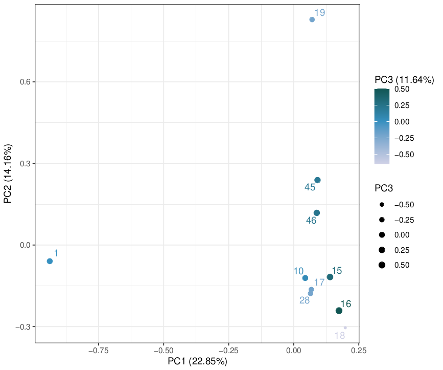

# DubDub: Automated DubSeq data analysis

Automated [DubSeq](https://github.com/psnovichkov/DubSeq) data analysis.


## About

```
./dubdub.sh -d <results directory> -f <fastq.gz directory> -l <barseq layout table> -L <library> [-U <pre-sequence> -P <pre-sequence position> -D <post-sequence> -t <time0 read count cutoff>]
```
to run pipeline in the _results directory_ using the specified _fastq.gz directory_ barcode sequencing files and _barseq layout table_ on the specified DubSeq _library_. Parameters in brackets are optional and are by default obtained from `config.sh`. Note that it is not necessary to run the pipeline from within the DubDub directory, _i.e._ any valid path to `dubdub.sh` works.

Analysis based on [Mutalik _et al._ (2019), DOI 10.1038/s41467-018-08177-8](https://www.nature.com/articles/s41467-018-08177-8) and [DubSeq version f452baa](https://github.com/psnovichkov/DubSeq/commit/f452baab7d9c9e56150803962dc755a5a39b78fd).


## System requirements

Linux operating system (Tested on Ubuntu 18.04.5 LTS, Ubuntu 20.04.1 LTS, and Linux Mint 18)

bash 4.0 (Tested with 4.4.20(1)-release and 5.0.17(1)-release)

Python 3.5 (Tested with 3.5.2, 3.5.4 and 3.7.6)

R ≥ 3.6.3 (Tested with 3.6.3)

GNU parallel 20161222 (Tested with 20161222)

Python libraries: numpy, scipy, pandas, sklearn

R libraries: tidyverse, ggrepel, scales


## Installation guide

Run the following in a terminal to download the DubDub pipeline into the directory `dubdub`:

```
git clone https://github.com/Asplund-Samuelsson/dubdub
```

Installation of the pipeline takes approximately 15 seconds depending on connection speed.


## Demonstration

To run DubDub on a DubSeq dataset, it is necessary to provide gzipped FASTQ (`fastq.gz`) files and a barseq layout table describing the samples, as well as specifying a BagSeq library ("BPAG" and GFF files). If different from the defaults configured in `config.sh`, it is also necessary to provide the correct upstream (pre-) and downstream (post-) sequences adjacent to the barcodes, as well as the expected beginning position of the upstream sequence.

### Commands

Before beginning the demonstration, make sure that the `dubdub` directory is the current working directory in your terminal:

```
cd dubdub
```

Now, first take a look at the compressed example FASTQ files in `example/data`:

```
ls -1 example/data
```

```
10_S10_L002_R1_001.fastq.gz
15_S15_L002_R1_001.fastq.gz
16_S16_L002_R1_001.fastq.gz
17_S17_L002_R1_001.fastq.gz
18_S18_L002_R1_001.fastq.gz
19_S19_L002_R1_001.fastq.gz
1_S1_L001_R1_001.fastq.gz
1_S1_L002_R1_001.fastq.gz
1_S1_L003_R1_001.fastq.gz
1_S1_L004_R1_001.fastq.gz
28_S28_L002_R1_001.fastq.gz
45_S45_L002_R1_001.fastq.gz
46_S46_L002_R1_001.fastq.gz
```

The pipeline assumes that each `fastq.gz` file name contains of four underscore-separated fields before the file extension, as in the output from multiple Illumina sequencing lanes. In the first listed file, those fields are `S10_L002_R1_001`. Everything after the fourth underscore, counting from the end, is assumed to be the sample name (which may include underscores). In the first listed file, the sample name is `10`.

All `fastq.gz` files in the input directory will be concatenated per sample in a new directory when the pipeline is running. This is to allow supplying files that are separated by lanes. An example of multiple lanes for the same sample is seen for sample `1` above. The `fastq.gz` files may be provided in any number per sample and in any sub-directory structure; The pipeline will find them all.

Now take a look at how sample information should be provided in the tab-delimited barseq layout file:

```
cat example/example_barseq_layout.tab
```

```
sample	type	name
1	stress	Nickel (II) chloride hexahydrate, 1.2mM
10	LB	LB
15	stress	Sodium nitrate, 200mM
16	stress	Sodium nitrate, 300mM
17	stress	Sisomicin sulfate salt, 0.001mg/ml
18	stress	Sisomicin sulfate salt, 0.0025mg/ml
19	stress	Sisomicin sulfate salt, 0.005mg/ml
28	LB	LB
45	Time0	Time0
46	Time0	Time0
```

The example data is a chimeric dataset with barcodes from one experiment and sub-sampled sequencing data from [Mutalik _et al._ (2019), DOI 10.1038/s41467-018-08177-8](https://www.nature.com/articles/s41467-018-08177-8). The results will not make any biological sense, but similar samples should in general cluster in the PCA that is run automatically by DubDub. `Time0` or `stress` must be provided in the `type` column and denote untreated and treated samples, respectively.

Next, inspect the `example` library provided in DubDub:

```
ls libraries/example
```

```
example.bpag.tab  example.gff
```

The "BPAG" file `example.bpag.tab` contains BagSeq mappings of barcodes to genomic fragments generated by the DubSeq `bpag.py` script, while the GFF file `example.gff` contains genome annotations. Check how these files should be structured:

```
head -5 libraries/example/example.*
```

```
==> libraries/example/example.bpag.tab <==
barcode_up	barcode_dn	bpair_count	pos_from	pos_end	region_len	recommended	up_read_count	up_contig_id	up_pos	up_strand	dn_read_count	dn_contig_id	dn_pos	dn_strand
CTCGGTGTTGCGGGTCCGCC	CCATTGAGATTCGCCTCCGG	2	1166684	1174542	7859	+	53	Chromosome	1166684	+	45	Chromosome	1174542	-
GAAAGAGCGTGGTGCATTAG	TACCGGCATGGTGTGGGGCG	4	907275	848991	-58283	-	154	Chromosome	848991	-	114	Chromosome	907275	+
AGGCGATCTTAGGGGCAGAT	GGCGTCTCGGTCCAGTAACC	49	3520019	2169440	-1350578	-	254	Chromosome	3520019	+	238	Chromosome	2169440	-
GGGCGGGGTATAGACCTGTC	GTGTGAGTGATGGTGCCTAC	16	37586	44706	7121	+	77	Chromosome	37586	+	72	Chromosome	44706	-

==> libraries/example/example.gff <==
Chromosome	Custom	gene	-200	772	.	+	0	product=prenyltransferase;locus_tag=slr0611;ID=SGL_RS01875
Chromosome	Custom	gene	811	1494	.	+	0	product=hypothetical protein;locus_tag=slr0612;ID=SGL_RS01880
Chromosome	Custom	gene	1577	2098	.	+	0	product=hypothetical protein;locus_tag=slr0613;ID=SGL_RS01885
Chromosome	Custom	gene	2172	2873	.	-	0	product=Ycf53-like protein;locus_tag=sll0558;ID=SGL_RS01890
Chromosome	Custom	gene	3192	4268	.	-	0	product=magnesium-protoporphyrin IX monomethyl ester;locus_tag=sll1214;ID=SGL_RS01895
```

Note that the contig ID columns must contain matching IDs, and both the `locus_tag` and `ID` attributes in the ninth GFF column will be used by the pipeline. A new library may be set up manually and called by `dubdub.sh`.

The demonstration example below takes 2 minutes and 30 seconds to run on a dual core 1.5 GHz system with 4 GB RAM. This command will run the DubDub pipeline in the directory `example/results`, which will be created automatically:

```
./dubdub.sh -d example/results -f example/data -l example/example_barseq_layout.tab -L example -U CAGCGTACG -P 14 -D AGAGACC
```

Note that non-default upstream and downstream sequences are needed for the example library. A default set of values may be written in the `config.sh` file, allowing the user to skip supplying the `-U`, `-P`, and `-D` flags for each run.


### Expected output

The pipeline will store seven files in the specified output directory:

```
ls -1 example/results
```

```
gene_score_PCA.pdf
gene_scores.tab
intermediate_data.tar.gz
layout.tab
layout.valid.tab
sample_itnum.tab
valid_samples.txt
```

The `gene_score_PCA.pdf` plots PCA results based on the NNLS gene fitness scores for all samples. The `gene_scores.tab` table contains all fitness scores for each gene in all samples. The compressed archive `intermediate_data.tar.gz` contains intermediate files and may be deleted to save space. The `layout.tab` table is a copy of the supplied barseq layout table, but with 'itnum' IDs instead of sample IDs. The `layout.valid.tab` contains only valid samples, _i.e._ those with at least one barcode that is "recommended" and has at least 10 time zero reads. The `sample_itnum.tab` table maps 'itnum' IDs to the original sample IDs. The `valid_samples.txt` file lists the valid samples (see above).

The PCA clustering analysis should look like this:


### Further instructions

#### Setting up a new library

To use a new library with DubDub, it is necessary to create a directory under `libraries` with the name of the new library, and two files also labeled with the library name. Let's use the `7002` library as an example, but we will call it `Syn7002` instead:

```
mkdir libraries/Syn7002
```

Populate the new library with a "BPAG" file that has been created with the DubSeq `bpag.py` script:

```
cp libraries/7002/7002.bpag.tab libraries/Syn7002/Syn7002.bpag.tab
```

The GFF file for the genome of interest may be generated with a GenBank file matching the genome used to generate the "BPAG" file:

```
source/genbank_to_gff.py libraries/7002/7002.gb libraries/Syn7002/Syn7002.gff
```

The GFF file is specifically designed to work with the DubDub and DubSeq scripts and a differently sourced GFF file may not work.

Once the library has been populated with a "BPAG" and GFF file, it is ready for use with `dubdub.sh` using the flag `-L Syn7002`.

#### Combination libraries

It may be desirable to analyze data obtained from experiments where multiple libraries have been cultivated together. To create a combination library, use the `combine_libraries.R` script:

```
source/combine_libraries.R <new library name> <library 1> <library 2> <...>
```

Any number of libraries may be combined. The `combo` library was created from `7002`, `Syn6803`, `Syn6803_OE1`, and `Utex` in this way. If the same barcodes label multiple genomic fragments, deduplicated (`dedup`) and multi-fragment (`multi`) barcode files are generated along the regular unique barcode "BPAG" file in the new library:

```
ls -1 libraries/combo
```

```
combo.bpag.tab
combo.dedup.bpag.tab
combo.gff
combo.multi.bpag.tab
```

When running DubDub on such a library it will take a `Dedup detour` to run the `fscore.py` script in order to calculate fragment scores along the gene scores. Gene scores can only be calculated based on fragments with unique barcodes, so the fragment scores may be used to investigate further the impact of genes situated on fragments with non-unique barcodes. Fragment scores are stored in a file named `fragment_scores.tab`, which includes information about what genes are present on the fragments.

Note that in order to accommodate that `Syn6803` and `Syn6803_OE1` represent the same organism, it was necessary to make the `Syn6803_OE1` GFF file empty, and run the following command after combining the libraries:

```
perl -p -i -e 's/Syn6803_OE1_/Syn6803_/g' libraries/combo/*
```

#### Concatenating compressed FASTQ files

The pipeline automatically removes concatenated `fastq.gz` files from the output directory to save space. If concatenated fastq.gz files are desired, run the concatenation script manually:

```
source/concatenate_fastq.sh example/data example/fastq
```

## Author

Johannes Asplund-Samuelsson (johannes.aspsam@gmail.com)
